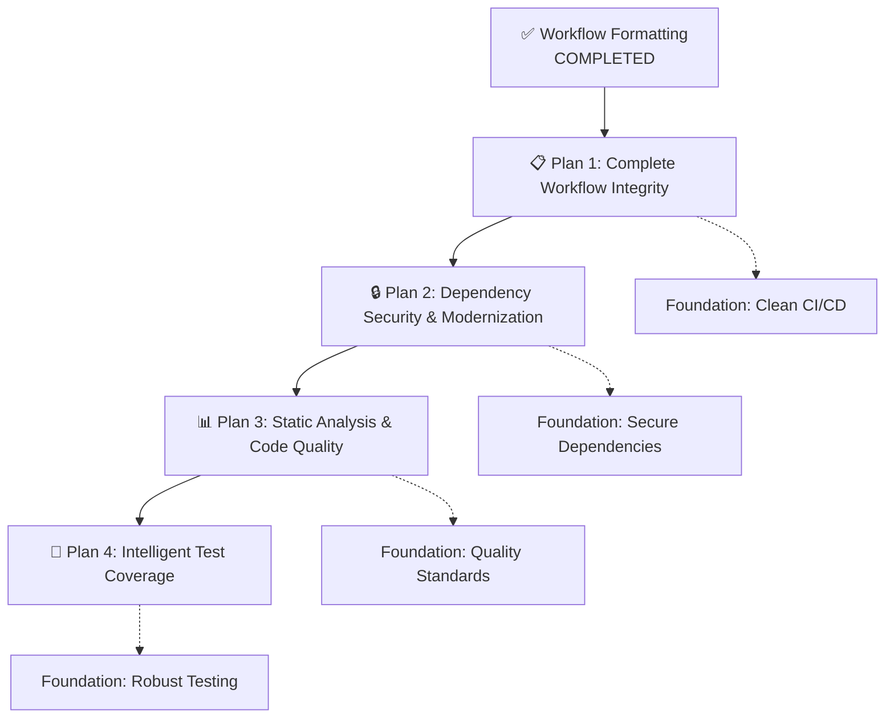

# Strategic Development Plans

This directory contains comprehensive, actionable plans for systematic code quality improvements, built upon the successful GitHub workflow formatting project.

## 📋 Plan Overview

### Execution Sequence & Dependencies



## 🎯 Individual Plan Details

### [📋 Plan 1: Complete Workflow Integrity](./PLAN_1_Complete_Workflow_Integrity.md)

**Priority**: 🔴 High (Immediate)  
**Complexity**: 🟢 Low  
**Time**: 2-3 hours

**Goal**: Achieve 100% GitHub workflow formatting compliance by fixing the 2 remaining syntax errors

**Key MCP Tools**: `serena`, `gemini-cli`, `filesystem`, `todos`

**Success Criteria**:

- ✅ Both problematic YAML files pass Prettier formatting
- ✅ Complex JavaScript moved to external, testable scripts
- ✅ 100% workflow formatting compliance achieved

---

### [🔒 Plan 2: Dependency Security & Modernization](./PLAN_2_Dependency_Security_Modernization.md)

**Priority**: 🟡 High (Follow Plan 1)  
**Complexity**: 🔴 Medium-High  
**Time**: 1-3 days

**Goal**: Eliminate security vulnerabilities and modernize package ecosystem

**Key MCP Tools**: `gemini-cli`, `Context7`, `serena`, `filesystem`, `todos`

**Success Criteria**:

- ✅ Zero critical/high security vulnerabilities
- ✅ Key dependencies updated to latest stable versions
- ✅ Minimum 5 unused dependencies removed
- ✅ All breaking changes properly handled

---

### [📊 Plan 3: Static Analysis & Code Quality](./PLAN_3_Static_Analysis_Code_Quality.md)

**Priority**: 🟡 Medium (After Plans 1-2)  
**Complexity**: 🟡 Medium  
**Time**: 2-4 days

**Goal**: Implement advanced static analysis to identify and refactor complex, error-prone code

**Key MCP Tools**: `serena`, `gemini-cli`, `Context7`, `memory`, `filesystem`

**Success Criteria**:

- ✅ Unified ESLint configuration across client/server
- ✅ Zero linting errors with enhanced rule set
- ✅ 3+ high-complexity functions refactored
- ✅ Anti-patterns eliminated throughout codebase

---

### [🧪 Plan 4: Intelligent Test Coverage](./PLAN_4_Intelligent_Test_Coverage.md)

**Priority**: 🟢 Medium (After Plans 1-3)  
**Complexity**: 🟡 Medium  
**Time**: 2-3 days

**Goal**: Strategically improve test coverage by targeting critical, complex, under-tested areas

**Key MCP Tools**: `gemini-cli`, `serena`, `memory`, `filesystem`, `todos`

**Success Criteria**:

- ✅ 5%+ meaningful coverage increase in critical modules
- ✅ 3+ high-complexity functions reach >80% coverage
- ✅ Critical path coverage increased to 90%+
- ✅ Risk-based testing approach established

## 🛠️ MCP Tool Integration Strategy

### Systematic Tool Usage Across Plans

| Tool             | Plan 1 | Plan 2 | Plan 3 | Plan 4 | Primary Use Case                             |
| ---------------- | ------ | ------ | ------ | ------ | -------------------------------------------- |
| **`serena`**     | ✅     | ✅     | ✅✅✅ | ✅✅   | Semantic code analysis, complexity detection |
| **`gemini-cli`** | ✅✅   | ✅✅   | ✅✅   | ✅✅✅ | Command execution, analysis, strategy design |
| **`Context7`**   |        | ✅✅✅ | ✅✅   | ✅     | Library documentation, migration guides      |
| **`memory`**     |        |        | ✅✅   | ✅✅✅ | Knowledge graphs, relationship mapping       |
| **`filesystem`** | ✅✅   | ✅✅   | ✅✅   | ✅✅   | File operations, configuration management    |
| **`todos`**      | ✅✅   | ✅✅   | ✅     | ✅✅   | Task tracking and progress management        |

### Tool Synergy Patterns

**Intelligence Gathering**:

```
serena (code analysis) → gemini-cli (strategy) → memory (relationships)
```

**Implementation**:

```
filesystem (read) → gemini-cli (transform) → filesystem (write) → todos (track)
```

**Validation**:

```
gemini-cli (test) → serena (verify) → todos (complete)
```

## 📈 Cumulative Success Metrics

### Quality Progression

| Metric                         | Baseline | After Plan 1 | After Plan 2   | After Plan 3 | After Plan 4 |
| ------------------------------ | -------- | ------------ | -------------- | ------------ | ------------ |
| **Workflow Compliance**        | 95%      | **100%**     | 100%           | 100%         | 100%         |
| **Security Vulnerabilities**   | TBD      | TBD          | **0 Critical** | 0 Critical   | 0 Critical   |
| **Code Quality Score**         | TBD      | TBD          | TBD            | **Improved** | Improved     |
| **Test Coverage (Meaningful)** | TBD      | TBD          | TBD            | TBD          | **+5% Min**  |

### Strategic Value Chain

1. **Plan 1** → Clean CI/CD foundation enables reliable automation
2. **Plan 2** → Secure, modern dependencies enable advanced tooling
3. **Plan 3** → Quality standards enable confident refactoring
4. **Plan 4** → Comprehensive testing enables rapid, safe development

## 🔄 Plan Management

### Status Tracking

- **📋 Ready to Start**: Plan is comprehensive and ready for execution
- **🟡 In Progress**: Plan is being actively executed
- **✅ Completed**: Plan objectives achieved and validated
- **⏸️ Paused**: Plan execution temporarily halted
- **🔄 Under Review**: Plan results being evaluated

### Update Schedule

- **Active Plans**: Weekly updates with progress and blockers
- **Completed Plans**: Monthly reviews for continuous improvement opportunities
- **All Plans**: Quarterly strategic review and evolution

### Maintenance

Each plan includes:

- ✅ **Progress Tracking**: Detailed task completion monitoring
- ✅ **Quality Metrics**: Measurable success criteria
- ✅ **Risk Assessment**: Identified risks and mitigation strategies
- ✅ **Resource Requirements**: Tool usage and time estimates
- ✅ **Dependency Management**: Prerequisites and blockers

## 🎯 Strategic Vision

### Short-term (1-2 months)

Execute Plans 1-4 in sequence, establishing robust foundations for:

- Clean, maintainable CI/CD workflows
- Secure, modern dependency ecosystem
- High-quality, consistent code standards
- Comprehensive, intelligent test coverage

### Medium-term (3-6 months)

Build upon established foundations:

- Automated quality monitoring and reporting
- Advanced static analysis and security scanning
- Performance monitoring and optimization
- Team process optimization and tooling

### Long-term (6+ months)

Achieve development excellence:

- Self-improving development processes
- Predictive quality and security analysis
- Automated technical debt management
- Knowledge-driven development decision making

---

**Plan Collection Maintainer**: Claude Code with MCP Tools  
**Last Updated**: 2025-01-31  
**Next Review**: Weekly during active execution
