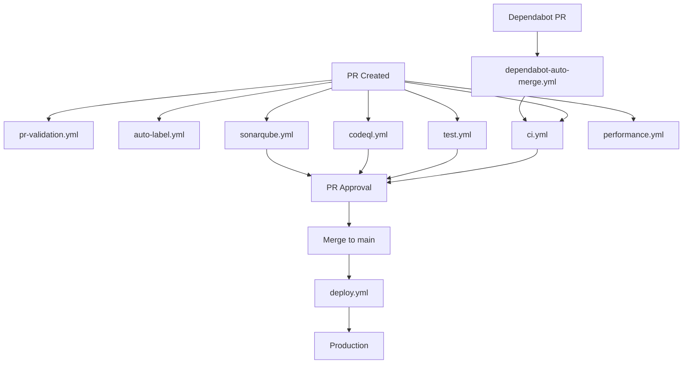

# GitHub Workflows Documentation

This directory contains automated workflows that power the CI/CD pipeline and repository management for the Running Tracker MVP.

## 📋 Workflow Overview

### 🔄 Core CI/CD Workflows

#### **ci.yml** - Main CI Pipeline

- **Triggers**: Push to `main`/`develop`, PRs to `main`/`develop`
- **Purpose**: Code quality, testing, building
- **Jobs**:
  - Quality checks (linting, formatting, type checking)
  - Unit tests with coverage
  - Integration tests
  - Build verification
- **Artifacts**: Build outputs, test coverage reports
- **Duration**: ~5-8 minutes

#### **test.yml** - Dedicated Testing

- **Triggers**: Push, PR events
- **Purpose**: Comprehensive test suite execution
- **Jobs**: Unit, integration, e2e tests
- **Coverage**: Frontend (React), Backend (Express), Database (Prisma)
- **Reports**: Test results, coverage metrics

### 🚀 Deployment Workflows

#### **deploy.yml** - Production Deployment

- **Triggers**: Push to `main` (after CI passes)
- **Purpose**: Deploy to production environment
- **Strategy**: Standard deployment with health checks
- **Rollback**: Automatic on failure
- **Notifications**: Slack/Teams integration

#### **deploy-rolling.yml** - Rolling Deployment

- **Triggers**: Manual or scheduled
- **Purpose**: Zero-downtime deployments
- **Strategy**: Gradual instance replacement
- **Monitoring**: Real-time health monitoring

#### **rollback.yml** - Automated Rollback

- **Triggers**: Deployment failure, manual trigger
- **Purpose**: Restore previous stable version
- **Speed**: < 2 minutes rollback time
- **Safety**: Preserves data integrity

### 🔒 Security & Quality Workflows

#### **codeql.yml** - Security Analysis

- **Triggers**: Push to `main`, PRs, scheduled weekly
- **Purpose**: Static security analysis
- **Languages**: JavaScript, TypeScript
- **Output**: SARIF reports, security alerts
- **Integration**: GitHub Security tab

#### **sonarqube.yml** - Code Quality Analysis

- **Triggers**: Push, PR events
- **Purpose**: Code quality metrics, technical debt
- **Metrics**: Coverage, complexity, duplication
- **Reports**: SonarQube dashboard
- **Quality Gates**: Configurable pass/fail criteria

#### **license-check.yml** - License Compliance

- **Triggers**: PRs, dependency updates
- **Purpose**: Verify license compatibility
- **Scope**: All dependencies and their licenses
- **Alerts**: Incompatible license detection

### 📊 Performance & Monitoring

#### **performance.yml** - Performance Testing

- **Triggers**: PRs, scheduled runs
- **Purpose**: Performance regression detection
- **Tools**: Lighthouse CI, custom benchmarks
- **Metrics**: Core Web Vitals, load times
- **Alerts**: Performance degradation notifications

### 🤖 Automation Workflows

#### **dependabot-auto-merge.yml** - Dependency Management

- **Triggers**: Dependabot PRs
- **Purpose**: Automated dependency updates
- **Safety**: Only patch/minor updates
- **Verification**: Full CI pipeline before merge
- **Grouping**: Smart dependency grouping

#### **auto-label.yml** - Issue/PR Labeling

- **Triggers**: Issues, PRs opened/modified
- **Purpose**: Automatic label assignment
- **Logic**: File path analysis, content analysis
- **Labels**: Feature, bug fix, documentation, etc.

#### **stale.yml** - Stale Content Management

- **Triggers**: Scheduled (daily)
- **Purpose**: Clean up stale issues/PRs
- **Timeline**: 30 days inactive → stale, 7 days → close
- **Exceptions**: Pinned issues, certain labels

### 🔧 Maintenance Workflows

#### **maintenance.yml** - Repository Maintenance

- **Triggers**: Scheduled (weekly)
- **Purpose**: Repository health maintenance
- **Tasks**: Cache cleanup, artifact pruning
- **Reports**: Maintenance summary

#### **release.yml** - Release Management

- **Triggers**: Version tags (v\*)
- **Purpose**: Automated release creation
- **Features**: Release notes generation, asset compilation
- **Distribution**: GitHub Releases, NPM (if applicable)

### 🧠 AI-Assisted Workflows

#### **claude.yml** - AI Code Review

- **Triggers**: PR events
- **Purpose**: AI-powered code review assistance
- **Features**: Code suggestions, best practices
- **Integration**: Comments on PRs

#### **claude-code-review.yml** - Enhanced AI Review

- **Triggers**: Large PRs, complex changes
- **Purpose**: Deep code analysis
- **Features**: Architecture review, security analysis

#### **pr-validation.yml** - PR Validation

- **Triggers**: PR opened/updated
- **Purpose**: Validate PR requirements
- **Checks**: Branch naming, description completeness
- **Requirements**: CODEOWNERS approval, CI passing

## 🎯 Workflow Dependencies



## 📈 Performance Metrics

### Workflow Execution Times

- **ci.yml**: 5-8 minutes
- **test.yml**: 3-5 minutes
- **deploy.yml**: 8-12 minutes
- **codeql.yml**: 10-15 minutes
- **performance.yml**: 3-5 minutes

### Success Rates (Target)

- **CI Pipeline**: > 95%
- **Deployments**: > 98%
- **Security Scans**: 100% completion
- **Performance Tests**: > 90% pass rate

## 🔧 Configuration Management

### Secrets Required

- `CODECOV_TOKEN`: Code coverage reporting
- `SONAR_TOKEN`: SonarQube integration
- `DEPLOY_TOKEN`: Production deployment
- `SLACK_WEBHOOK`: Notification integration

### Environment Variables

- `NODE_ENV`: Environment context
- `DATABASE_URL`: Database connection
- `JWT_SECRET`: Authentication secret

## 🚨 Troubleshooting

### Common Issues

#### Workflow Failures

1. **Lint failures**: Check ESLint configuration
2. **Test failures**: Verify test environment setup
3. **Build failures**: Check dependencies and build scripts
4. **Deploy failures**: Verify secrets and environment config

#### Performance Issues

1. **Slow CI**: Review job parallelization
2. **Cache misses**: Verify cache key configuration
3. **Resource limits**: Monitor workflow resource usage

### Debug Commands

```bash
# Local testing
npm run lint          # Check linting issues
npm run test          # Run test suite
npm run build         # Verify build process
npm run dev           # Test development setup
```

## 📚 Best Practices

### Workflow Development

1. Test workflows in feature branches
2. Use job dependencies for efficiency
3. Implement proper error handling
4. Cache dependencies for speed
5. Use matrix strategies for testing multiple environments

### Security

1. Never commit secrets to workflows
2. Use minimal permissions for tokens
3. Validate all external inputs
4. Regular security scan reviews

### Maintenance

1. Regular workflow updates
2. Monitor execution metrics
3. Clean up unused workflows
4. Document workflow changes

## 🔄 Workflow Update Process

1. **Development**: Create feature branch
2. **Testing**: Test workflow changes in PR
3. **Review**: Code review for workflow files
4. **Deployment**: Merge to main
5. **Monitoring**: Watch first execution
6. **Documentation**: Update this README

---

**Need Help?** Check the [GitHub Actions documentation](https://docs.github.com/en/actions) or create an issue for workflow-related questions.
