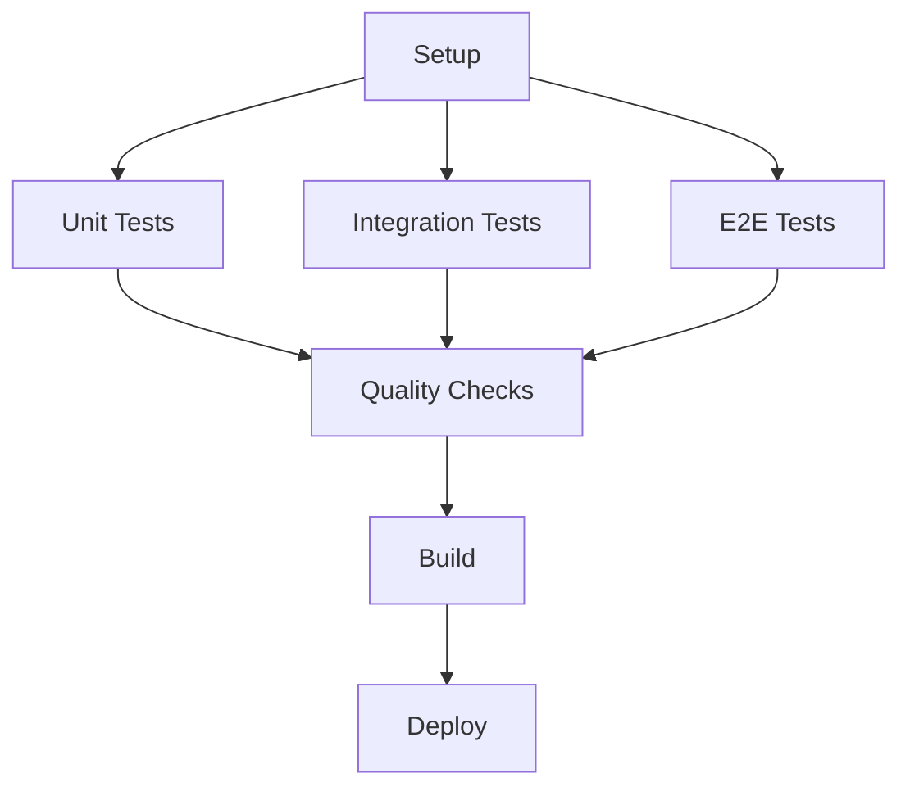

# CI Configuration Documentation

## Overview

This document provides comprehensive information about the CI/CD pipeline configuration for the Running App MVP project. The project uses GitHub Actions for continuous integration and deployment, with multiple workflows handling different aspects of testing, quality assurance, and deployment.

## Table of Contents

1. [Workflows Overview](#workflows-overview)
2. [Environment Variables](#environment-variables)
3. [Test Configurations](#test-configurations)
4. [Database Setup](#database-setup)
5. [Browser Testing](#browser-testing)
6. [Performance Monitoring](#performance-monitoring)
7. [Security Configurations](#security-configurations)
8. [Troubleshooting](#troubleshooting)

## Workflows Overview

### Primary Workflows

#### 1. `ci.yml` - Main CI Pipeline

- **Trigger**: Push to main branches, pull requests
- **Purpose**: Core CI/CD pipeline with comprehensive testing
- **Jobs**:
  - `unit-tests`: Vitest unit tests
  - `integration-tests`: Jest integration tests
  - `e2e-tests`: Playwright end-to-end tests
  - `quality-checks`: Linting, type checking, formatting
  - `build`: Production build verification

#### 2. `test.yml` - Cross-Platform Testing

- **Trigger**: Push, pull requests, manual dispatch
- **Purpose**: Multi-platform and Node.js version testing
- **Matrix**: Ubuntu, Windows, macOS × Node.js 20.x, 22.x
- **Tests**: Unit, integration, accessibility, visual regression

#### 3. `coverage-check.yml` - Coverage Analysis

- **Trigger**: Push, pull requests
- **Purpose**: Code coverage validation and reporting
- **Thresholds**: 70% minimum coverage (75% in CI)

#### 4. `test-performance-tracking.yml` - Performance Monitoring

- **Trigger**: Daily schedule, after CI completion
- **Purpose**: Track test execution performance and trends
- **Features**: Regression detection, automated issue creation

### Specialized Workflows

#### 5. `parallel-tests.yml` - Parallel Test Execution

- **Purpose**: Optimized parallel test execution with sharding
- **Features**: Automatic test categorization, performance analysis

#### 6. `deploy.yml` / `deploy-rolling.yml` - Deployment

- **Trigger**: Push to main, release tags
- **Purpose**: Production deployment with rolling updates

#### 7. `release.yml` - Release Management

- **Trigger**: Release creation
- **Purpose**: Automated release builds and artifact publishing

## Environment Variables

### Core Test Variables

| Variable       | Purpose               | Required | Default                 | Workflows          |
| -------------- | --------------------- | -------- | ----------------------- | ------------------ |
| `NODE_ENV`     | Environment mode      | Yes      | `test`                  | All test workflows |
| `DATABASE_URL` | SQLite database path  | Yes      | `file:./prisma/test.db` | All workflows      |
| `JWT_SECRET`   | Authentication secret | Yes      | 76-char secure string   | All workflows      |

### Database Configuration

| Variable            | Purpose             | Default                      | Description                 |
| ------------------- | ------------------- | ---------------------------- | --------------------------- |
| `DATABASE_URL`      | Primary database    | `file:./prisma/test.db`      | SQLite file for tests       |
| `E2E_DATABASE_URL`  | E2E test database   | `file:./prisma/e2e-test.db`  | Isolated E2E database       |
| `A11Y_DATABASE_URL` | Accessibility tests | `file:./prisma/a11y-test.db` | Accessibility test database |
| `RUN_MIGRATIONS`    | Migration control   | `false`                      | Skip migrations in tests    |

### Security Variables

| Variable               | Purpose              | Default        | Notes                   |
| ---------------------- | -------------------- | -------------- | ----------------------- |
| `JWT_SECRET`           | JWT token signing    | 76-char string | Must be >32 characters  |
| `BCRYPT_ROUNDS`        | Password hashing     | `12`           | Code default if not set |
| `LOG_SALT`             | Log encryption       | Not set        | Production only         |
| `AUDIT_ENCRYPTION_KEY` | Audit log encryption | Not set        | Optional for tests      |
| `ENCRYPTION_KEY`       | Data encryption      | Not set        | Optional for tests      |

### Performance & Testing

| Variable                   | Purpose             | Default        | Description                          |
| -------------------------- | ------------------- | -------------- | ------------------------------------ |
| `CI`                       | CI environment flag | `true`         | Enables CI-specific behavior         |
| `VITEST_SHARD`             | Test sharding       | Not set        | Format: "1/4" for parallel execution |
| `PLAYWRIGHT_BROWSERS_PATH` | Browser cache       | System default | Playwright browser storage           |

### Build & Deployment

| Variable       | Purpose             | Default                     | Notes              |
| -------------- | ------------------- | --------------------------- | ------------------ |
| `NODE_OPTIONS` | Node.js flags       | `--experimental-vm-modules` | Required for Jest  |
| `BUILD_MODE`   | Build configuration | `production`                | Build optimization |

## Test Configurations

### Unit Tests (Vitest)

**Configuration Files:**

- `vitest.config.ts` - Local development
- `vitest.config.ci.ts` - CI environment
- `vitest.config.parallel.ts` - Parallel execution

**CI-Specific Settings:**

```typescript
{
  testTimeout: 30000,        // 30s timeout
  hookTimeout: 20000,        // 20s hooks
  maxThreads: 2,             // Limited parallelism
  retry: 2,                  // Retry flaky tests
  coverage: {
    thresholds: {
      lines: 75,             // Higher than local (70)
      functions: 75,
      branches: 75,
      statements: 75
    }
  }
}
```

### Integration Tests (Jest)

**Configuration Files:**

- `jest.config.js` - Local development
- `jest.config.ci.js` - CI environment

**CI-Specific Settings:**

```javascript
{
  testTimeout: 30000,        // 30s timeout
  maxWorkers: 1,             // Sequential execution
  maxConcurrency: 1,         // No concurrent tests
  forceExit: true,           // Clean shutdown
  detectOpenHandles: true,   // Debug handles
  retry: 3                   // Retry wrapper
}
```

### E2E Tests (Playwright)

**Configuration Files:**

- `playwright.config.ts` - Local development
- `playwright.config.ci.ts` - CI environment
- `playwright.config.headless.ts` - Headless testing

**CI-Specific Settings:**

```typescript
{
  timeout: 60000,            // 60s test timeout
  actionTimeout: 15000,      // 15s action timeout
  navigationTimeout: 45000,  // 45s navigation
  workers: 1,                // Single worker
  retries: 3,                // Triple retry
  headless: true,            // No GUI
  browsers: ['chromium']     // Chrome only
}
```

## Database Setup

### CI Database Lifecycle

1. **Cleanup**: Remove existing database files
2. **Migration**: Run Prisma migrations
3. **Generation**: Generate Prisma client
4. **Verification**: Test database connectivity
5. **Seeding**: Add test data (if needed)
6. **Teardown**: Clean up after tests

### Database Scripts

```bash
# Setup database for CI
npm run ci-db-setup

# Verify database setup
npm run verify-db-setup

# Cleanup database
npm run ci-db-teardown
```

### Migration Strategy

```bash
# Primary migration command
npx prisma migrate dev --name init

# Fallback for CI
npx prisma migrate deploy

# Client generation
npx prisma generate
```

## Browser Testing

### Playwright Browser Installation

```bash
# Install all browsers with dependencies
npx playwright install --with-deps

# Install specific browser (CI)
npx playwright install --with-deps chromium
```

### Browser Configuration

**CI Environment:**

- Browser: Chromium only (performance)
- Mode: Headless
- Viewport: 1280×720
- Launch Args: `--no-sandbox`, `--disable-setuid-sandbox`

**Cross-Platform:**

- Ubuntu: Full browser support
- Windows: Limited to Node.js 22.x
- macOS: Limited to Node.js 22.x

## Performance Monitoring

### Test Performance Tracking

**Metrics Tracked:**

- Test execution times
- Pass/fail rates
- Test count trends
- Performance regression detection

**Scripts:**

```bash
# Track all test suites
npm run test:performance:track

# Generate performance report
npm run test:performance:report

# View performance dashboard
npm run test:performance:dashboard:open
```

### Performance Thresholds

- **Regression Alert**: >5% performance degradation
- **Slow Test Threshold**: >5 seconds execution
- **Pass Rate Alert**: <95% success rate

## Security Configurations

### Secrets Management

**GitHub Secrets (if configured):**

- `NPM_TOKEN` - NPM publishing
- `DEPLOY_KEY` - Deployment credentials
- `SLACK_WEBHOOK` - Notifications

### Environment Security

- JWT secrets are hardcoded for test environments
- Production secrets must be properly configured
- Encryption keys are optional in test environments
- Log salts are not required for CI

## Troubleshooting

### Common CI Failures

#### 1. Unit Test Failures

```bash
# Check environment variables
echo $DATABASE_URL
echo $JWT_SECRET
echo $NODE_ENV

# Verify database setup
npm run verify-db-setup

# Run tests locally with CI config
npm run test:coverage:unit:ci
```

#### 2. Integration Test Failures

```bash
# Check database connectivity
npm run ci-db-setup

# Verify Jest configuration
npm run verify-jest-workers

# Run with verbose output
npm run test:integration:ci -- --verbose
```

#### 3. E2E Test Failures

```bash
# Verify browser installation
npx playwright --version

# Check browser dependencies
npx playwright install --with-deps chromium

# Run with headed mode locally
npm run test:e2e -- --headed
```

#### 4. Performance Issues

```bash
# Check test performance
npm run test:performance:report

# Identify slow tests
npm run analyze-test-performance

# Track performance trends
npm run test:performance:trends
```

### Debug Commands

```bash
# Full CI simulation locally
npm run test:all:complete

# Validate CI environment
npm run validate-test-env

# Check lint and type errors
npm run lint:check

# Build verification
npm run build
```

### Environment Debugging

```bash
# Check Node.js version
node --version

# Verify npm configuration
npm config list

# Check package integrity
npm ci --dry-run

# Validate TypeScript configuration
npx tsc --noEmit
```

## Workflow Dependencies

### Job Dependencies



### Cache Dependencies

- **Node Modules**: `package-lock.json` hash
- **Playwright Browsers**: Version-based caching
- **Performance Data**: SHA + run number
- **Build Cache**: Source file dependencies

## Best Practices

### Environment Variables

- Always set `NODE_ENV=test` for test environments
- Use consistent JWT secrets across workflows
- Separate databases for different test types
- Set appropriate timeouts for CI environments

### Test Configuration

- Use CI-specific configurations with increased timeouts
- Limit parallelism to prevent resource conflicts
- Enable retries for flaky tests
- Use headless browsers in CI

### Performance

- Monitor test execution times regularly
- Set up alerts for performance regressions
- Use parallel execution where safe
- Cache dependencies and build artifacts

### Security

- Never commit secrets to version control
- Use environment-specific configurations
- Validate environment setup before tests
- Clean up sensitive data after tests

---

**Last Updated**: $(date)
**Maintained By**: Development Team
**Version**: 1.0
