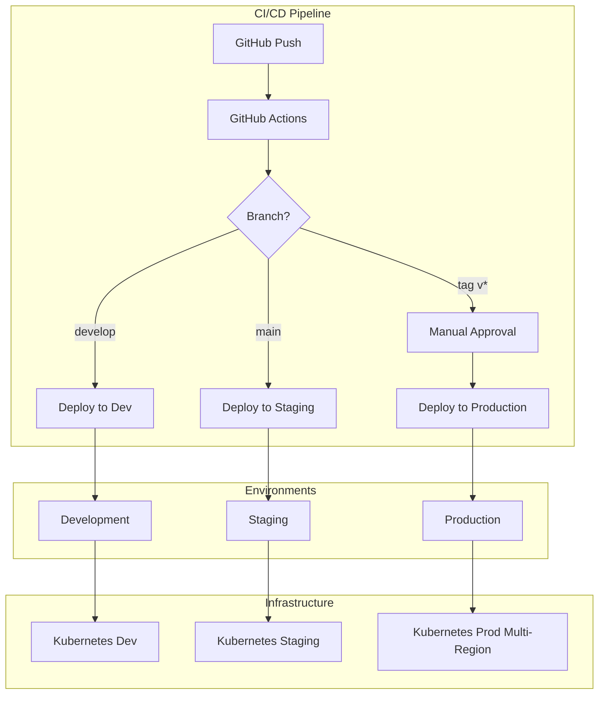

# Running App - Comprehensive Deployment Guide

## 🚀 Overview

This guide provides complete instructions for deploying the Running App using our CI/CD pipeline with rolling deployments, multi-environment support, and automated rollback capabilities.

## 📋 Table of Contents

1. [Architecture Overview](#architecture-overview)
2. [Prerequisites](#prerequisites)
3. [Environment Setup](#environment-setup)
4. [Deployment Strategies](#deployment-strategies)
5. [CI/CD Pipeline](#cicd-pipeline)
6. [Monitoring & Alerts](#monitoring--alerts)
7. [Rollback Procedures](#rollback-procedures)
8. [Troubleshooting](#troubleshooting)
9. [Best Practices](#best-practices)

## 🏗️ Architecture Overview



### Key Components

- **GitHub Actions**: Orchestrates the entire CI/CD pipeline
- **Docker**: Containerizes the application
- **Kubernetes**: Manages container orchestration
- **Prometheus/Grafana**: Monitors deployments and application health
- **External Secrets Operator**: Manages secrets securely

## 📚 Prerequisites

### Required Tools

```bash
# Check required tools
./scripts/check-prerequisites.sh

# Install missing tools
brew install kubectl helm jq yq
brew install --cask docker
```

### Access Requirements

1. **GitHub Repository Access**
   - Write access to the repository
   - Ability to create/manage secrets
   - Environment configuration permissions

2. **Cloud Provider Access**
   - Kubernetes cluster access
   - Container registry permissions
   - Secret management access

3. **Monitoring Access**
   - Grafana dashboard access
   - Prometheus query permissions
   - Alert manager access

## 🔧 Environment Setup

### Step 1: Configure GitHub Secrets

```bash
# Run the automated setup script
./scripts/setup-github-secrets.sh

# Or manually set secrets in GitHub UI
# Go to: Settings > Secrets and variables > Actions
```

### Step 2: Configure Environments

1. Navigate to repository Settings > Environments
2. Create environments: `development`, `staging`, `production`, `production-approval`
3. Configure protection rules as documented in `.github/environments-setup.md`

### Step 3: Initialize Cloud Infrastructure

```bash
# For AWS EKS
eksctl create cluster -f deployment/eks-cluster.yaml

# For Google GKE
gcloud container clusters create running-app-cluster \
  --region=us-central1 \
  --num-nodes=3 \
  --enable-autoscaling

# For Azure AKS
az aks create \
  --resource-group running-app-rg \
  --name running-app-cluster \
  --node-count 3 \
  --enable-cluster-autoscaler
```

### Step 4: Install Required Operators

```bash
# Install External Secrets Operator
helm repo add external-secrets https://charts.external-secrets.io
helm install external-secrets \
  external-secrets/external-secrets \
  -n external-secrets-system \
  --create-namespace

# Install Prometheus Stack
helm repo add prometheus-community https://prometheus-community.github.io/helm-charts
helm install kube-prometheus-stack \
  prometheus-community/kube-prometheus-stack \
  -n monitoring \
  --create-namespace
```

## 🚀 Deployment Strategies

### Rolling Deployment (Default)

```yaml
strategy:
  type: RollingUpdate
  rollingUpdate:
    maxSurge: 25%
    maxUnavailable: 0
```

**Use when:**

- Standard application updates
- Zero-downtime requirements
- Gradual rollout preferred

### Canary Deployment

```bash
# Deploy canary with 10% traffic
./scripts/deploy-canary.sh \
  --environment production \
  --image ghcr.io/yourusername/running-app:v2.0.0 \
  --percentage 10
```

**Use when:**

- High-risk changes
- Testing with real traffic
- Performance validation needed

### Blue-Green Deployment

```bash
# Deploy to inactive color
./scripts/deploy-blue-green.sh \
  --environment production \
  --image ghcr.io/yourusername/running-app:v2.0.0
```

**Use when:**

- Database schema changes
- Major version upgrades
- Instant rollback required

## 🔄 CI/CD Pipeline

### Pipeline Stages

1. **Security Scanning**
   - Trivy vulnerability scanning
   - SAST with Semgrep
   - Secret detection

2. **Build & Test**
   - Unit tests with coverage
   - Integration tests
   - Build Docker image

3. **Deploy to Development**
   - Automatic on push to `develop`
   - No approval required

4. **Deploy to Staging**
   - Automatic on push to `main`
   - Comprehensive testing

5. **Production Approval**
   - Manual approval required
   - Deployment report review

6. **Deploy to Production**
   - Multi-region deployment
   - Canary analysis
   - Automated rollback on failure

### Triggering Deployments

#### Automatic Deployments

```bash
# Development deployment
git push origin develop

# Staging deployment
git push origin main

# Production deployment
git tag -a v1.2.3 -m "Release v1.2.3"
git push origin v1.2.3
```

#### Manual Deployments

```bash
# Via GitHub UI
# Actions > Deploy > Run workflow

# Via GitHub CLI
gh workflow run deploy-rolling.yml \
  -f environment=production \
  -f deployment_percentage=10
```

## 📊 Monitoring & Alerts

### Grafana Dashboards

Access dashboards at: `https://grafana.example.com`

- **Deployment Dashboard**: `/d/running-app-deployments`
- **Application Metrics**: `/d/running-app-metrics`
- **Infrastructure**: `/d/kubernetes-cluster`

### Key Metrics

```promql
# Deployment success rate
sum(deployment_success_total) / sum(deployment_total)

# Average deployment duration
histogram_quantile(0.95, deployment_duration_seconds_bucket)

# Application error rate
sum(rate(http_requests_total{status=~"5.."}[5m])) / sum(rate(http_requests_total[5m]))
```

### Alert Channels

1. **Slack**: `#deployments` channel
2. **Email**: `platform-team@example.com`
3. **PagerDuty**: Critical production alerts

## 🔄 Rollback Procedures

### Automatic Rollback

Triggered automatically when:

- Health checks fail
- Error rate exceeds 5%
- Response time exceeds SLA

### Manual Rollback

```bash
# Quick rollback to previous version
./scripts/execute-rollback.sh \
  --environment production \
  --strategy immediate

# Gradual rollback
./scripts/execute-rollback.sh \
  --environment production \
  --strategy gradual \
  --target-version v1.2.2
```

### Emergency Rollback

Via GitHub Actions:

1. Go to Actions > Emergency Rollback
2. Click "Run workflow"
3. Select environment and strategy
4. Provide reason
5. Approve when prompted

## 🔧 Troubleshooting

### Common Issues

#### Deployment Stuck

```bash
# Check deployment status
kubectl rollout status deployment/running-app-backend-prod -n running-app-prod

# View deployment events
kubectl describe deployment running-app-backend-prod -n running-app-prod

# Check pod logs
kubectl logs -l app=running-app,environment=production -n running-app-prod
```

#### Health Check Failures

```bash
# Test health endpoint
kubectl exec -it deployment/running-app-backend-prod -n running-app-prod -- \
  curl http://localhost:3001/api/health

# Check database connectivity
kubectl exec -it deployment/running-app-backend-prod -n running-app-prod -- \
  npx prisma db push --skip-generate
```

#### Image Pull Errors

```bash
# Verify image exists
docker manifest inspect ghcr.io/yourusername/running-app:tag

# Check image pull secrets
kubectl get secret ghcr-secret -n running-app-prod -o yaml

# Recreate pull secret
kubectl create secret docker-registry ghcr-secret \
  --docker-server=ghcr.io \
  --docker-username=USERNAME \
  --docker-password=TOKEN \
  -n running-app-prod
```

### Debug Commands

```bash
# Get all resources
kubectl get all -n running-app-prod -l app=running-app

# Describe problematic pod
kubectl describe pod POD_NAME -n running-app-prod

# Get recent events
kubectl get events -n running-app-prod --sort-by='.lastTimestamp'

# Check resource usage
kubectl top pods -n running-app-prod
kubectl top nodes
```

## 📋 Best Practices

### Pre-Deployment Checklist

- [ ] All tests passing in CI
- [ ] Security scans completed
- [ ] Database migrations reviewed
- [ ] Performance benchmarks met
- [ ] Rollback plan documented
- [ ] Stakeholders notified
- [ ] Monitoring alerts configured

### Deployment Windows

- **Production**: Tuesday-Thursday, 10 AM - 4 PM
- **Staging**: Any time
- **Emergency**: Follow incident process

### Post-Deployment Verification

1. **Immediate (0-5 minutes)**
   - Health checks passing
   - No error spike
   - Response times normal

2. **Short-term (5-30 minutes)**
   - Business metrics stable
   - No customer complaints
   - Resource usage normal

3. **Long-term (24 hours)**
   - Performance trends stable
   - No memory leaks
   - Database connections stable

### Security Considerations

1. **Never commit secrets**
   - Use External Secrets Operator
   - Rotate secrets regularly
   - Audit secret access

2. **Image scanning**
   - Fix critical vulnerabilities before deployment
   - Use specific image tags, not `latest`
   - Sign images with cosign

3. **Network policies**
   - Implement least-privilege access
   - Use service mesh for mTLS
   - Regular security audits

## 📞 Support

### Escalation Path

1. **Level 1**: Platform Team on-call
2. **Level 2**: Senior Platform Engineer
3. **Level 3**: Engineering Manager
4. **Level 4**: CTO

### Contact Information

- **Slack**: `#platform-support`
- **On-call**: Via PagerDuty
- **Email**: `platform-team@example.com`

### Useful Links

- [Deployment Runbook](https://wiki.example.com/deployment-runbook)
- [Architecture Diagrams](https://wiki.example.com/architecture)
- [Incident Response](https://wiki.example.com/incident-response)
- [Post-Mortem Template](https://wiki.example.com/post-mortem)

---

## 🎉 Summary

You now have a complete CI/CD pipeline with:

- ✅ Multi-environment deployments
- ✅ Rolling, canary, and blue-green strategies
- ✅ Automated testing and security scanning
- ✅ Manual approval workflows
- ✅ Comprehensive monitoring and alerting
- ✅ Automated rollback procedures
- ✅ Disaster recovery capabilities

Remember: **Deployment success = Preparation + Automation + Monitoring**

For questions or improvements, please open an issue or contact the platform team.
