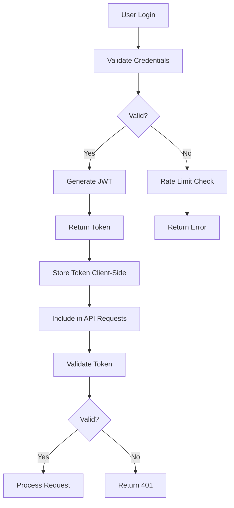

# Security Policy

## Table of Contents

1. [Reporting Security Vulnerabilities](#reporting-security-vulnerabilities)
2. [Security Architecture](#security-architecture)
3. [Authentication & Authorization](#authentication--authorization)
4. [Data Protection](#data-protection)
5. [API Security](#api-security)
6. [Infrastructure Security](#infrastructure-security)
7. [Security Headers](#security-headers)
8. [Rate Limiting](#rate-limiting)
9. [Secure Development Practices](#secure-development-practices)
10. [Security Checklist](#security-checklist)
11. [Incident Response](#incident-response)

## Reporting Security Vulnerabilities

We take the security of our running tracker application seriously. If you discover a security vulnerability, please report it to us as described below.

### How to Report

- **Email**: Send details to the maintainer's email with subject line "SECURITY VULNERABILITY"
- **GitHub**: Create a private security advisory on GitHub (preferred)
- **Scope**: Include reproduction steps, impact assessment, and suggested fixes

### What to Expect

- **Acknowledgment**: Within 24 hours
- **Assessment**: Within 72 hours
- **Resolution**: Based on severity (Critical: 1-7 days, High: 7-14 days, Medium: 14-30 days)

### Responsible Disclosure

Please do not publicly disclose security vulnerabilities until we have had a chance to address them.

## Security Architecture

### Authentication Flow



### Security Layers

1. **Transport Layer**: HTTPS/TLS encryption
2. **Application Layer**: Input validation, authentication, authorization
3. **Data Layer**: Encrypted storage, parameterized queries
4. **Infrastructure Layer**: Firewall, VPC, security groups

## Authentication & Authorization

### JWT Implementation

**Current Status**: ⚠️ **Needs Improvement**

#### Secure JWT Configuration

```javascript
// Recommended JWT signing
const token = jwt.sign(
  { 
    id: user.id, 
    email: user.email,
    iat: Math.floor(Date.now() / 1000),
    jti: crypto.randomUUID(), // Unique token ID
    type: 'access' // Token type
  }, 
  process.env.JWT_SECRET, 
  {
    algorithm: 'HS256',
    expiresIn: '1h', // Reduced from 7 days
    issuer: 'running-app',
    audience: 'running-app-users'
  }
);
```

#### Token Security Best Practices

- **Secret Management**: Use strong, randomly generated secrets (minimum 256 bits)
- **Token Expiration**: Access tokens expire in 1 hour, refresh tokens in 7 days
- **Token Rotation**: Implement refresh token rotation
- **Token Revocation**: Maintain blacklist for revoked tokens

```bash
# Generate secure JWT secret
openssl rand -base64 32
```

### Password Security

**Current Status**: ⚠️ **Needs Improvement**

#### Password Requirements

```javascript
const passwordSchema = z.string()
  .min(12, 'Password must be at least 12 characters')
  .regex(/[A-Z]/, 'Must contain uppercase letter')
  .regex(/[a-z]/, 'Must contain lowercase letter')
  .regex(/[0-9]/, 'Must contain number')
  .regex(/[^A-Za-z0-9]/, 'Must contain special character')
  .refine(password => !COMMON_PASSWORDS.includes(password.toLowerCase()), 
    'Password is too common');
```

#### Hashing Implementation

```javascript
// Current: bcrypt with cost factor 12 ✅
const saltRounds = 12;
const hashedPassword = await bcrypt.hash(password, saltRounds);
```

### Authorization Model

- **Resource-based**: Users can only access their own data
- **Route-level**: Authentication required for all API endpoints except public routes
- **Field-level**: Sensitive fields filtered from responses

## Data Protection

### Data Classification

| Type | Classification | Protection Level |
|------|---------------|------------------|
| User Credentials | Confidential | Encrypted at rest, hashed passwords |
| Personal Data | Restricted | Encrypted in transit, access logged |
| Activity Data | Internal | Standard encryption |
| System Logs | Internal | Anonymized, retention policy |

### Encryption

- **In Transit**: TLS 1.3 minimum
- **At Rest**: Database encryption enabled
- **Key Management**: Environment variables, consider HSM for production

### Privacy Protection

```javascript
// Secure logging with PII redaction
const sanitizedData = {
  ...data,
  email: hashPII(data.email),
  ipAddress: hashPII(data.ipAddress)
};
```

## API Security

### Input Validation

**Current Status**: ✅ **Implemented**

```javascript
// Zod schema validation
const createRunSchema = z.object({
  date: z.string().regex(/^\d{4}-\d{2}-\d{2}$/),
  distance: z.number().positive().max(1000),
  duration: z.number().positive().max(86400),
  route: z.string().max(500)
});
```

### SQL Injection Prevention

**Current Status**: ✅ **Protected via Prisma ORM**

```javascript
// Parameterized queries via Prisma
const runs = await prisma.run.findMany({
  where: { userId: req.user.id },
  orderBy: { date: 'desc' }
});
```

### XSS Prevention

**Current Status**: ✅ **Input sanitization implemented**

```javascript
// Input sanitization middleware
app.use(sanitizeInput);
```

### CORS Configuration

**Current Status**: ❌ **Needs Configuration**

```javascript
// Recommended CORS setup
app.use(cors({
  origin: process.env.ALLOWED_ORIGINS?.split(',') || ['http://localhost:3000'],
  credentials: true,
  methods: ['GET', 'POST', 'PUT', 'DELETE'],
  allowedHeaders: ['Content-Type', 'Authorization'],
  optionsSuccessStatus: 200
}));
```

## Infrastructure Security

### Environment Variables

```bash
# Required security environment variables
JWT_SECRET=                    # 256-bit random string
DATABASE_URL=                  # Encrypted connection string
BCRYPT_ROUNDS=12              # Password hashing rounds
RATE_LIMITING_ENABLED=true    # Enable rate limiting
ALLOWED_ORIGINS=              # Comma-separated allowed origins
SESSION_SECRET=               # Session encryption key
```

### Deployment Security

- **HTTPS Only**: Redirect all HTTP traffic to HTTPS
- **Security Headers**: Implement comprehensive security headers
- **Monitoring**: Enable security event logging and monitoring
- **Updates**: Regular dependency updates and security patches

## Security Headers

**Current Status**: ⚠️ **Partial Implementation**

### Current Headers

```javascript
// Currently implemented
res.setHeader('X-Content-Type-Options', 'nosniff');
res.setHeader('X-Frame-Options', 'DENY');
res.setHeader('Referrer-Policy', 'strict-origin-when-cross-origin');
```

### Recommended Headers

```javascript
// Install helmet.js for comprehensive security headers
import helmet from 'helmet';

app.use(helmet({
  contentSecurityPolicy: {
    directives: {
      defaultSrc: ["'self'"],
      styleSrc: ["'self'"], // Consider removing 'unsafe-inline' to prevent CSS injection
      scriptSrc: ["'self'"],
      imgSrc: ["'self'", "data:", "https:"],
      connectSrc: ["'self'"],
      fontSrc: ["'self'"],
      objectSrc: ["'none'"],
      mediaSrc: ["'self'"],
      frameSrc: ["'none'"],
    },
  },
  crossOriginEmbedderPolicy: false,
  hsts: {
    maxAge: 31536000,
    includeSubDomains: true,
    preload: true
  }
}));
```

## Rate Limiting

**Current Status**: ✅ **Excellent Implementation**

### Authentication Endpoints

```javascript
// Very strict rate limiting for auth
const authLimiter = rateLimit({
  windowMs: 15 * 60 * 1000, // 15 minutes
  max: 5, // 5 attempts per window
  message: 'Too many authentication attempts',
  standardHeaders: true,
  legacyHeaders: false,
});
```

### API Endpoints

- **Authenticated Users**: 100 requests per 15 minutes
- **Data Modification**: 50 requests per 15 minutes
- **Bulk Operations**: 10 requests per 15 minutes

## Secure Development Practices

### Code Review Requirements

- [ ] All security-sensitive code reviewed by 2+ developers
- [ ] Automated security scanning in CI/CD
- [ ] Dependency vulnerability checking
- [ ] Static code analysis

### Security Testing

```javascript
// Security test examples
describe('Authentication Security', () => {
  it('should prevent SQL injection in login', async () => {
    const maliciousInput = "'; DROP TABLE users; --";
    const response = await request(app)
      .post('/api/auth/login')
      .send({ email: maliciousInput, password: 'test' });
    expect(response.status).toBe(400);
  });

  it('should rate limit failed login attempts', async () => {
    // Test rate limiting implementation
  });
});
```

### Dependency Management

```bash
# Regular security auditing
npm audit
npm audit fix

# Check for known vulnerabilities
npx audit-ci --moderate
```

## Security Checklist

### Pre-Deployment

- [ ] JWT secret is cryptographically secure (256+ bits)
- [ ] CORS configured for production domains only
- [ ] All security headers implemented
- [ ] Rate limiting configured and tested
- [ ] Input validation covers all endpoints
- [ ] Error messages don't leak sensitive information
- [ ] Database connections use SSL/TLS
- [ ] No secrets in source code or logs

### Post-Deployment

- [ ] HTTPS enforced with valid certificates
- [ ] Security monitoring and alerting configured
- [ ] Log analysis for security events
- [ ] Regular security updates scheduled
- [ ] Backup and recovery procedures tested
- [ ] Incident response plan documented

### Regular Maintenance

- [ ] Monthly dependency updates
- [ ] Quarterly security assessment
- [ ] Annual penetration testing
- [ ] Security training for developers

## Incident Response

### Security Incident Classification

1. **Critical**: Data breach, system compromise, unauthorized access
2. **High**: Service disruption, authentication bypass
3. **Medium**: Information disclosure, DoS attack
4. **Low**: Security configuration issue, minor vulnerability

### Response Procedures

1. **Immediate Response** (0-1 hours)
   - Identify and contain the threat
   - Assess impact and scope
   - Notify stakeholders

2. **Investigation** (1-24 hours)
   - Collect evidence and logs
   - Determine root cause
   - Document findings

3. **Recovery** (24-72 hours)
   - Implement fixes
   - Restore services
   - Verify security measures

4. **Post-Incident** (1-2 weeks)
   - Conduct lessons learned review
   - Update security measures
   - Improve monitoring and detection

### Emergency Contacts

- **Security Team**: [Contact Information]
- **System Administrators**: [Contact Information]
- **Legal Team**: [Contact Information]

## References

- [OWASP Top 10](https://owasp.org/www-project-top-ten/)
- [NIST Cybersecurity Framework](https://www.nist.gov/cyberframework)
- [JWT Security Best Practices](https://auth0.com/blog/a-look-at-the-latest-draft-for-jwt-bcp/)
- [Node.js Security Checklist](https://blog.risingstack.com/node-js-security-checklist/)

---

**Last Updated**: January 2025  
**Next Review**: July 2025  
**Version**: 1.0

For questions about this security policy, please contact the development team.